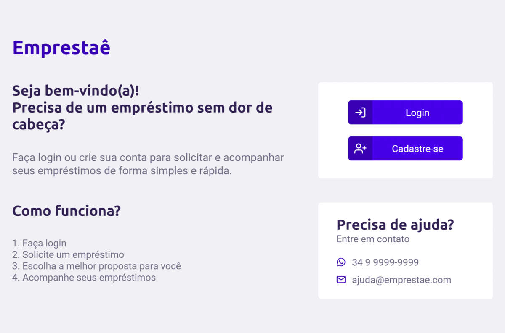

# Emprestaê

Projeto feito para o desafio proposto pela TQI.

** Para testar a aplicação completa, é necessário subir o servidor, disponível em: https://github.com/gabrielmendes98/emprestae-server **

Esse projeto foi feito com React e contempla as seguintes funcionalidades:

- Cadastro
- Login
- Mudança de senha
- Solicitação de empréstimos
- Acompanhamento dos empréstimos pedidos
- Validação dos formulários
- Toast de erro

As principais bibliotecas utilizadas para a realização desse projeto, foram:

- axios (requisições http)
- react-icons (para os ícones)
- react-toastify (para mostrar os toasts de erro tanto do front, como os vindos do backend)
- styled-components (para a estilização da interface)
- typescript (para adicionar tipagem)
- yup (para validar os inputs e selects dos formulários)

Para a autenticação, utilizei o Context do React.

Utilizei o json-server para criar um backend fake para que fosse possível realizar as requisições e para gerar o JWT.

## Observações finais:

Quando um novo empréstimo é realizado, ele sempre vem com o status de "em análise", pois em uma aplicação real, esse status seria alterado posteriormente. Para ver a interface com os outros status, basta alterar o db.json do servidor, ou logar com o usuário `gabriel@gmail.com` e senha `123456`, pois ele tem outros status.

** Para testar a aplicação completa, é necessário subir o servidor disponível abaixo **

## Link para o servidor backend

https://github.com/gabrielmendes98/emprestae-server

## Instalation

`yarn install`

## Start the app

`yarn start`

## Live demo
